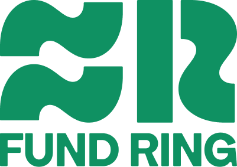
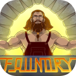
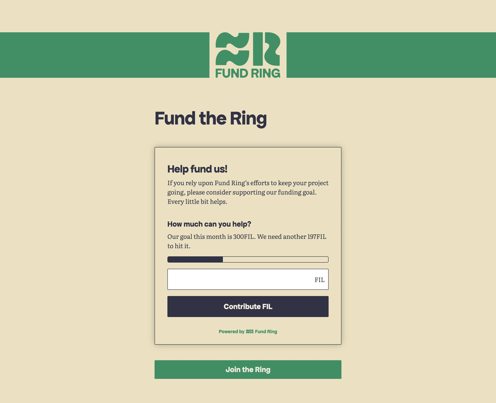
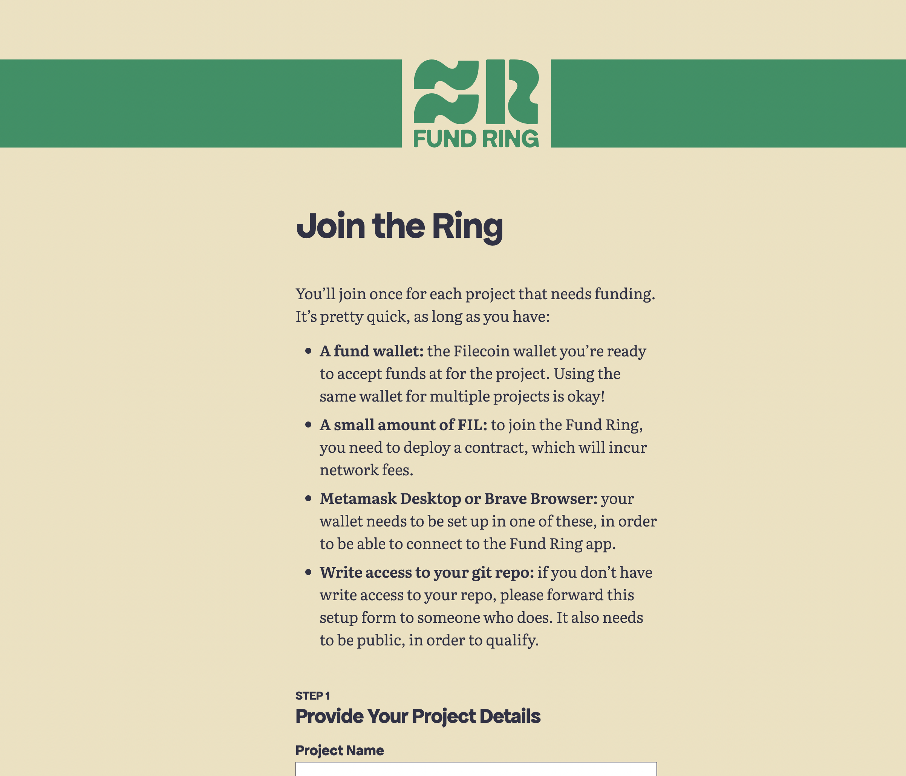

<a name="readme-top"></a>

# Fund Ring

[](https://fission.codes) [](https://discord.gg/zAQBDEq) [](https://talk.fission.codes)

<!-- PROJECT LOGO -->
<style>
  .block {
    display: block;
  }

  .marginBottom {
    margin-bottom: 20px;
  }

  a {
    color: #0F9162;
  }

  .text-green {
    color: #0F9162;
  }

  .constrainWidth {
    margin: auto;
    max-width: 600px;
  }
</style>
<br />
<div align="center">
  <a href="https://github.com/FundRing/fundring" class="block marginBottom">
    
  </a>

  <h1 align="center">Fund Ring</h1>

  <p align="center" class="constrainWidth">
    Fund Ring is a smart contract standard and set of ready-to-embed components, designed to simplify the process of receiving funding for your project in FIL.
    <br />
    <br />
    <a href="https://github.com/FundRing/fundring/Best-README-Template"><strong>Explore the docs »</strong></a>
    <br />
    <br />
    <a href="https://fundring.fission.app">View Demo</a>
    ·
    <a href="https://github.com/FundRing/fundring/issues">Report Bug</a>
    ·
    <a href="https://github.com/FundRing/fundring/issues">Request Feature</a>
  </p>
</div>

<!-- TABLE OF CONTENTS -->
<h3>Table of Contents</h3>
<ol>
  <li>
    <a href="#about-the-project">About The Project</a>
    <ul>
      <li><a href="#built-with">Built With</a></li>
    </ul>
  </li>
  <li>
    <a href="#usage">Usage</a>
    <ul>
      <li><a href="#contributing-to-the-master-fund-ring-contract">Contributing to the master Fund Ring contract</a></li>
      <li><a href="#joining-the-fund-ring">Joining the Fund Ring</a></li>
    </ul>
  </li>
  <li>
    <a href="#getting-started">Getting Started</a>
    <ul>
      <li><a href="#prerequisites">Prerequisites</a></li>
      <li><a href="#installation">Installation</a></li>
      <li><a href="#static-build">Static Build</a></li>
      <li><a href="#building-the-widget-web-component">Building the widget web-component</a></li>
      <li><a href="#embedding-the-fund-ring-widget-in-your-app">Embedding the Fund Ring widget in your app</a></li>
    </ul>
  </li>
  <li><a href="#contributing">Contributing</a></li>
  <li><a href="#license">License</a></li>
  <li><a href="#contact">Contact</a></li>
</ol>

<!-- ABOUT THE PROJECT -->

## About The Project

#### Do you run a FLOSS project?

Fund Ring is a smart contract standard and set of ready-to-embed components, designed to simplify the process of receiving funding for your project in FIL.

#### Get a little help from your friends

When you join Fund Ring, you join a broad community of FLOSS projects. It’s like a good ol’ fashioned web ring for funding.

#### Help shine a light on projects that matter

You have full control over how you connect to the Fund Ring. You can use it to highlight other projects you run or rely on.

#### Simple to setup

All you need is a git repo and a Filecoin wallet. Our wizard will guide you through the quick setup process.

<p align="right">(<a href="#readme-top" class="text-green">back to top</a>)</p>

### Built With

<div align="left">
  <a href="https://kit.svelte.dev/">
    
  </a>
  <a href="https://www.typescriptlang.org/">
    
  </a>
  <a href="https://walletconnect.com/">
    
  </a>
  <a href="https://book.getfoundry.sh/">
    
  </a>
  <a href="https://docs.ethers.org/v5/">
    
  </a>
  <a href="https://wagmi.sh/core/getting-started">
    
  </a>
  <a href="https://web3.storage/">
    
  </a>
</div>

<p align="right">(<a href="#readme-top" class="text-green">back to top</a>)</p>

<!-- USAGE EXAMPLES -->

## Usage

You can try out the app yourself [here](https://fundring.fission.app/).

### Contributing to the master Fund Ring contract

You can contribute funds to the main Fund Ring project [here](https://fundring.fission.app/fund). Funds from this contract can be used to fund projects the community votes for.

This is an example of the Funding widget that you could instead point to your project's deployed contract:



<p align="right">(<a href="#readme-top" class="text-green">back to top</a>)</p>

### Joining the Fund Ring

You can apply [here](https://fundring.fission.app/join) to have your project join the Fund Ring.

This page will deploy a Fund Ring contract for your project, which you will be the owner of. It will also provide you with the code to embed a Funding widget web-component in your project



<p align="right">(<a href="#readme-top" class="text-green">back to top</a>)</p>

<!-- GETTING STARTED -->

## Getting Started

Ready? Let's go.

### Prerequisites

-   Install `npm`
    ```sh
    npm install npm@latest -g
    ```
-   Install a wallet client that supports the [FEVM](https://docs.filecoin.io/smart-contracts/fundamentals/filecoin-evm-runtime/)

    -   [MetaMask](https://metamask.io/) may be a good/easy choice if you don't already have a wallet client

-   Get a WalletConnect ProjectID at [https://cloud.walletconnect.com/sign-up](https://cloud.walletconnect.com/sign-up)
-   Get a Web3.Storage key at [https://web3.storage/login/](https://web3.storage/login/)

<p align="right">(<a href="#readme-top" class="text-green">back to top</a>)</p>

### Installation

1. Clone the repo
    ```sh
    git clone https://github.com/oddsdk/fundring.git
    ```
2. Navigate to project directory
    ```sh
    cd fundring
    ```
3. Install NPM packages
    ```sh
    npm install
    ```
4. Start the application in dev mode
    ```js
    npm run dev
    ```

<p align="right">(<a href="#readme-top" class="text-green">back to top</a>)</p>

### Static Build

Export a static build.

```shell
npm run build
```

The build outputs the static site to the `build` directory.

<p align="right">(<a href="#readme-top" class="text-green">back to top</a>)</p>

### Building the widget web-component

If you are making updates to the widget component and want to export it as an embeddable web-component, you can run:

```shell
npm run build:web-components
```

The build outputs `fund-ring-widget.js` and `fund-ring-widget.js.amp` files to the `static` directory.

<p align="right">(<a href="#readme-top" class="text-green">back to top</a>)</p>

### Embedding the Fund Ring widget in your app

Once you have your `fund-ring-widget.js` file, you can embed it in your app using:

```js
<script src="fund-ring-widget.js"></script>

<fund-ring-widget
  contractAddress="<YOUR_DEPLOYED_FUND_RING_CONTRACT_ADDRESS>"
  title="A title for the widget"
  bodyCopy="A brief description to display in the body"
/>

```

<p align="right">(<a href="#readme-top" class="text-green">back to top</a>)</p>

<!-- CONTRIBUTING -->

## Contributing

Contributions are what make the open source community such an amazing place to learn, inspire, and create. Any contributions you make are **greatly appreciated**.

If you have a suggestion that would make this better, please fork the repo and create a pull request. You can also simply open an [issue](https://github.com/oddsdk/fundring/issues) with the tag "enhancement".
Don't forget to give the project a star! Thanks again!

1. Fork the Project
2. Create your Feature Branch (`git checkout -b feature/AmazingFeature`)
3. Commit your Changes (`git commit -m 'Add some AmazingFeature'`)
4. Push to the Branch (`git push origin feature/AmazingFeature`)
5. Open a Pull Request

<p align="right">(<a href="#readme-top" class="text-green">back to top</a>)</p>

<!-- LICENSE -->

## License

Distributed under the MIT License.

<p align="right">(<a href="#readme-top" class="text-green">back to top</a>)</p>

<!-- CONTACT -->

## Contact

-   Project Link: [https://github.com/oddsdk/fundring](https://github.com/oddsdk/fundring)
-   Discord: [https://fission.codes/discord/](https://fission.codes/discord/)

<p align="right">(<a href="#readme-top" class="text-green">back to top</a>)</p>

<!-- MARKDOWN LINKS & IMAGES -->
<!-- https://www.markdownguide.org/basic-syntax/#reference-style-links -->
